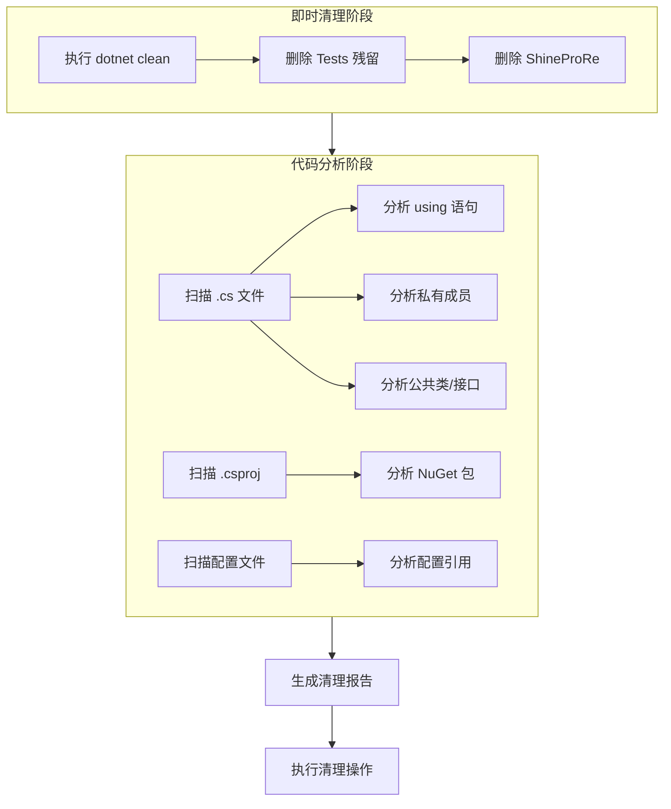

# Design Document: Code Cleanup

## Overview

本设计文档描述了 ShineProCS 项目代码清理功能的技术实现方案。清理工作分为两个阶段：
1. **即时清理阶段**：删除已确认的冗余文件夹和编译产物
2. **代码分析阶段**：系统性扫描代码，识别未使用的代码和引用

## Architecture



## Components and Interfaces

### 1. 即时清理组件

负责执行确定性的文件和文件夹删除操作。

**操作列表**：
- `dotnet clean` - 清理编译产物
- 删除 `Tests/bin` 和 `Tests/obj`
- 删除 `Tests` 空文件夹
- 删除 `ShineProRe` 文件夹

### 2. 代码分析组件

使用 IDE 诊断工具和手动代码审查相结合的方式进行分析。

**分析维度**：

| 分析项 | 方法 | 工具 |
|--------|------|------|
| 未使用 using | IDE 诊断 | VS Code / Rider |
| 未使用私有成员 | IDE 诊断 + 手动审查 | getDiagnostics |
| 未使用公共类 | 引用搜索 | grepSearch |
| 冗余 NuGet 包 | 命名空间使用分析 | 手动审查 |
| 重复代码 | 代码相似度分析 | 手动审查 |

### 3. 报告生成组件

生成 Markdown 格式的清理报告，包含：
- 问题分类汇总
- 每个问题的详细位置
- 建议的修复操作
- 风险等级评估

## Data Models

### CleanupIssue（清理问题）

```csharp
public class CleanupIssue
{
    public string FilePath { get; set; }      // 文件路径
    public int LineNumber { get; set; }        // 行号
    public IssueType Type { get; set; }        // 问题类型
    public string Description { get; set; }    // 问题描述
    public RiskLevel Risk { get; set; }        // 风险等级
    public string SuggestedFix { get; set; }   // 建议修复
}

public enum IssueType
{
    UnusedUsing,           // 未使用的 using
    UnusedPrivateMember,   // 未使用的私有成员
    UnusedPublicClass,     // 未使用的公共类
    UnusedNuGetPackage,    // 未使用的 NuGet 包
    DuplicateCode,         // 重复代码
    UnusedConfig,          // 未使用的配置
    RedundantFile          // 冗余文件
}

public enum RiskLevel
{
    Low,    // 低风险 - 可安全删除
    Medium, // 中风险 - 需要确认
    High    // 高风险 - 谨慎处理
}
```


## Correctness Properties

*A property is a characteristic or behavior that should hold true across all valid executions of a system-essentially, a formal statement about what the system should do. Properties serve as the bridge between human-readable specifications and machine-verifiable correctness guarantees.*

由于本功能是一次性的代码清理任务，而非持续运行的软件功能，验证方式主要通过具体示例和操作结果确认，而非属性测试。

### 验证方式

1. **文件系统验证**：清理操作前后对比文件系统状态
2. **编译验证**：清理后项目仍能成功编译
3. **IDE 诊断验证**：使用 getDiagnostics 工具验证代码问题
4. **引用搜索验证**：使用 grepSearch 确认代码引用关系

## Error Handling

### 清理操作错误处理

| 错误场景 | 处理方式 |
|----------|----------|
| 文件被占用无法删除 | 提示用户关闭相关程序后重试 |
| 权限不足 | 提示用户以管理员权限运行 |
| dotnet clean 失败 | 显示错误信息，继续执行其他清理任务 |
| 误删重要文件 | 建议用户使用 Git 恢复 |

### 代码分析错误处理

| 错误场景 | 处理方式 |
|----------|----------|
| 文件编码问题 | 跳过该文件，记录到报告 |
| 语法错误导致分析失败 | 标记为需要先修复语法错误 |
| 循环引用 | 记录引用链，人工审查 |

## Testing Strategy

### 验证清单

由于这是一次性清理任务，采用以下验证策略：

1. **即时清理验证**
   - [ ] `dotnet clean` 执行成功
   - [ ] Tests 文件夹已删除
   - [ ] ShineProRe 文件夹已删除
   - [ ] obj 文件夹中的 wpftmp 文件已清理

2. **代码分析验证**
   - [ ] 所有 .cs 文件已扫描
   - [ ] 未使用的 using 语句已识别
   - [ ] 未使用的私有成员已识别
   - [ ] 清理报告已生成

3. **最终验证**
   - [ ] 项目编译成功 (`dotnet build`)
   - [ ] 应用程序可正常启动
   - [ ] 无新增编译警告

## Implementation Notes

### 执行顺序

1. **Phase 1: 即时清理**（优先执行，风险低）
   - 执行 `dotnet clean`
   - 删除 Tests 残留
   - 删除 ShineProRe

2. **Phase 2: 代码分析**（需要审查）
   - 使用 IDE 诊断分析代码问题
   - 生成清理报告
   - 人工审查后执行清理

### 工具使用

| 任务 | 工具/命令 |
|------|-----------|
| 清理编译产物 | `dotnet clean` |
| 删除文件夹 | `rmdir /s /q` (Windows) |
| 代码诊断 | `getDiagnostics` |
| 引用搜索 | `grepSearch` |
| 文件列表 | `listDirectory` |
