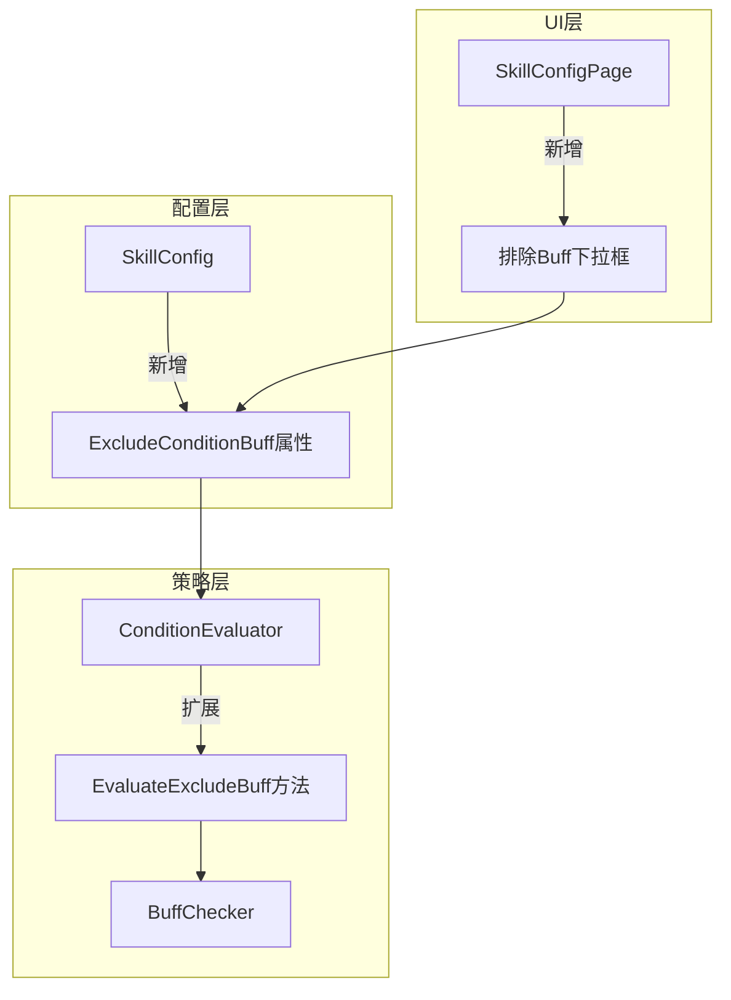

# 设计文档

## 概述

本设计通过扩展现有的SkillConfig模型和ConditionEvaluator服务，添加"排除Buff条件"功能。核心思路是：
1. 在SkillConfig中添加ExcludeConditionBuff属性
2. 在ConditionEvaluator中添加排除Buff检查逻辑
3. 更新预设配置以使用新功能
4. 在UI中添加配置支持

## 架构



## 组件和接口

### 1. SkillConfig模型扩展

在现有SkillConfig基础上添加以下属性：

```csharp
/// <summary>
/// 排除条件Buff - 当此Buff存在时跳过该技能
/// 与ConditionBuff相反：ConditionBuff要求Buff存在，ExcludeConditionBuff要求Buff不存在
/// </summary>
[ObservableProperty] private string _excludeConditionBuff = "";
```

### 2. ConditionEvaluator扩展

在EvaluateSkillConditions方法中添加排除Buff检查：

```csharp
/// <summary>
/// 评估排除Buff条件
/// 当ExcludeConditionBuff存在时，技能应被跳过
/// </summary>
private bool EvaluateExcludeConditionBuff(SkillConfig config)
{
    // 如果没有配置排除Buff，直接通过
    if (string.IsNullOrEmpty(config.ExcludeConditionBuff))
        return true;

    // 检查Buff是否存在，存在则返回false（跳过技能）
    return !_buffChecker.CheckBuffExists(config.ExcludeConditionBuff);
}
```

### 3. 条件检查顺序

更新后的条件检查顺序：
1. Enabled - 技能是否启用
2. SkillGroup - 技能组条件
3. ConditionBuff - 条件Buff（Buff存在才释放）
4. **ExcludeConditionBuff - 排除Buff（Buff存在则跳过）** ← 新增
5. RequireState - 状态要求
6. MinMp - MP条件
7. HpCondition - HP条件

## 数据模型

### 技能配置JSON结构更新

```json
{
  "Name": "七情和合",
  "KeyCode": 56,
  "Priority": 200,
  "Enabled": true,
  "ConditionBuff": "千枝气劲",
  "ExcludeConditionBuff": "七情气劲",
  "RequireState": "七情和合启用",
  "ClearStateOnCast": "七情和合启用"
}
```

## 正确性属性

*正确性属性是一种特征或行为，应该在系统的所有有效执行中保持为真。*

### Property 1: 排除Buff条件检查一致性

*对于任意*配置了ExcludeConditionBuff的技能和任意Buff状态，当Buff存在时技能应被跳过，当Buff不存在时技能应继续评估其他条件。

**验证: 需求 1.1, 1.2, 1.3**

### Property 2: 条件组合正确性

*对于任意*同时配置了ConditionBuff和ExcludeConditionBuff的技能，只有当ConditionBuff存在且ExcludeConditionBuff不存在时，技能才能通过条件检查。

**验证: 需求 2.3**

### Property 3: 空值处理正确性

*对于任意*ExcludeConditionBuff为空或null的技能，排除Buff检查应返回true（不阻止技能释放）。

**验证: 需求 2.4**

## 错误处理

1. **无效Buff引用**: 当ExcludeConditionBuff引用的Buff在BuffLibrary中不存在时，视为Buff不存在（不阻止技能释放）
2. **空字符串处理**: 当ExcludeConditionBuff为空字符串时，跳过该检查

## 测试策略

### 单元测试

- ExcludeConditionBuff属性的序列化/反序列化
- ConditionEvaluator的排除Buff检查逻辑
- 条件组合场景测试

### 属性测试

使用FsCheck进行属性测试：
- 生成随机技能配置和Buff状态
- 验证排除Buff检查的一致性
- 验证条件组合的正确性

### 集成测试

- 完整的技能选择流程测试（包含排除Buff条件）
- 预设配置加载后的行为验证

