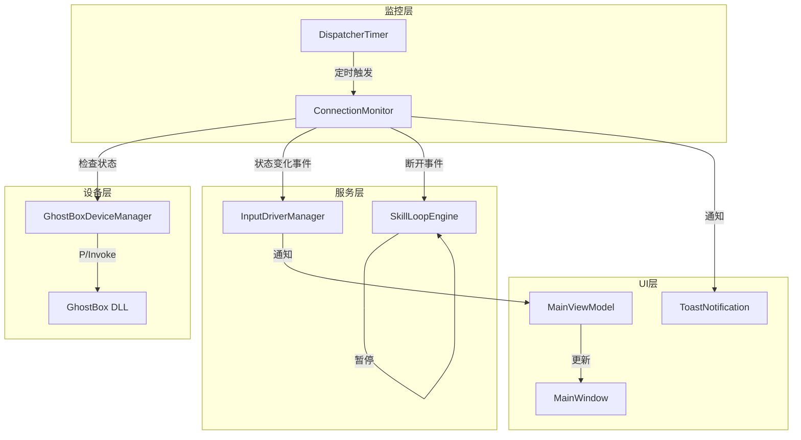

# Design Document: GhostBox Connection Monitor

## Overview

本设计为 GhostBox 硬件设备添加实时连接状态监控功能。通过后台轮询机制检测设备断开，自动更新 UI 状态，并在运行时优雅处理设备断开情况，同时提供自动重连能力。

## Architecture



## Components and Interfaces

### 1. ConnectionMonitor 类（新增）

负责定期检查设备连接状态并触发相应事件。

```csharp
namespace ShineProCS.Core.Services;

/// <summary>
/// 连接状态变化事件参数
/// </summary>
public class ConnectionStateChangedEventArgs : EventArgs
{
    public bool IsConnected { get; }
    public string Message { get; }
    public DateTime Timestamp { get; }
    
    public ConnectionStateChangedEventArgs(bool isConnected, string message)
    {
        IsConnected = isConnected;
        Message = message;
        Timestamp = DateTime.Now;
    }
}

/// <summary>
/// GhostBox 连接监控器
/// 定期检查设备连接状态，触发断开/重连事件
/// </summary>
public class ConnectionMonitor : IDisposable
{
    // 配置参数
    public int CheckIntervalMs { get; set; } = 1000;           // 检查间隔
    public int InitialReconnectIntervalMs { get; set; } = 2000; // 初始重连间隔
    public int MaxReconnectIntervalMs { get; set; } = 8000;     // 最大重连间隔
    public double BackoffMultiplier { get; set; } = 2.0;        // 退避倍数
    
    // 状态
    public bool IsMonitoring { get; private set; }
    public bool IsConnected { get; private set; }
    public int CurrentReconnectIntervalMs { get; private set; } // 当前重连间隔
    
    // 事件
    public event EventHandler<ConnectionStateChangedEventArgs>? ConnectionLost;
    public event EventHandler<ConnectionStateChangedEventArgs>? ConnectionRestored;
    public event EventHandler<int>? ReconnectAttempted; // 参数为当前间隔
    
    // 方法
    public void StartMonitoring();
    public void StopMonitoring();
    public void ResetBackoffInterval(); // 重置退避间隔
    public void Dispose();
}
```

### 2. GhostBoxDeviceManager 修改

添加实时状态检查方法，优化 `IsConnected` 属性。

```csharp
// 新增方法
/// <summary>
/// 实时检查设备连接状态（调用 DLL 的 isconnected）
/// 与 RefreshConnectionStatus 不同，此方法不更新内部状态，仅返回当前硬件状态
/// </summary>
public bool CheckConnectionRealtime()
{
    if (!IsDllAvailable) return false;
    try
    {
        return NativeIsConnected() != 0;
    }
    catch
    {
        return false;
    }
}
```

### 3. InputDriverManager 修改

集成 ConnectionMonitor，处理连接状态变化。

```csharp
// 新增属性
public ConnectionMonitor? ConnectionMonitor { get; private set; }

// 新增事件
public event EventHandler<ConnectionStateChangedEventArgs>? DeviceConnectionChanged;

// 修改 SwitchToGhostBox 方法，启动监控
// 修改 SwitchToWin32 方法，停止监控
```

### 4. SkillLoopEngine 修改

添加设备断开处理逻辑。

```csharp
// 新增字段
private bool _deviceDisconnected;
private DateTime _disconnectTime;

// 新增方法
/// <summary>
/// 处理设备断开事件
/// </summary>
public void OnDeviceDisconnected()
{
    _deviceDisconnected = true;
    _disconnectTime = DateTime.Now;
    Log("GhostBox 设备已断开，引擎将暂停", 2);
}

/// <summary>
/// 处理设备重连事件
/// </summary>
public void OnDeviceReconnected()
{
    _deviceDisconnected = false;
    Log("GhostBox 设备已重连", 1);
}
```

### 5. MainViewModel 修改

订阅连接状态事件，更新 UI 绑定属性。

```csharp
// 新增属性
[ObservableProperty]
private string _ghostBoxConnectionStatusColor = "Gray";

// 订阅事件
_inputDriverManager.DeviceConnectionChanged += OnDeviceConnectionChanged;

// 事件处理
private void OnDeviceConnectionChanged(object? sender, ConnectionStateChangedEventArgs e)
{
    Application.Current?.Dispatcher.Invoke(() =>
    {
        OnPropertyChanged(nameof(IsGhostBoxConnected));
        OnPropertyChanged(nameof(GhostBoxConnectionStatus));
        GhostBoxConnectionStatusColor = e.IsConnected ? "Green" : "Red";
        
        if (e.IsConnected)
            ToastManager.Success("GhostBox 设备已连接", "设备状态");
        else
            ToastManager.Warning("GhostBox 设备已断开", "设备状态");
    });
}
```

## Data Models

### ConnectionMonitorConfig（可选，用于持久化配置）

```csharp
public class ConnectionMonitorConfig
{
    /// <summary>
    /// 连接检查间隔（毫秒）
    /// </summary>
    public int CheckIntervalMs { get; set; } = 1000;
    
    /// <summary>
    /// 自动重连间隔（毫秒）
    /// </summary>
    public int ReconnectIntervalMs { get; set; } = 2000;
    
    /// <summary>
    /// 最大自动重连次数
    /// </summary>
    public int MaxReconnectAttempts { get; set; } = 3;
    
    /// <summary>
    /// 是否启用自动重连
    /// </summary>
    public bool EnableAutoReconnect { get; set; } = true;
}
```

## Correctness Properties

*A property is a characteristic or behavior that should hold true across all valid executions of a system—essentially, a formal statement about what the system should do. Properties serve as the bridge between human-readable specifications and machine-verifiable correctness guarantees.*

### Property 1: Connection State Synchronization

*For any* GhostBox device state change (connected → disconnected or disconnected → connected), the ConnectionMonitor SHALL detect the change and update its IsConnected property to match the actual device state within the configured check interval.

**Validates: Requirements 1.1, 1.2**

### Property 2: Event Firing on State Change

*For any* connection state transition, the ConnectionMonitor SHALL raise exactly one ConnectionLost event when transitioning from connected to disconnected, and exactly one ConnectionRestored event when transitioning from disconnected to connected.

**Validates: Requirements 1.3**

### Property 3: Resource Cleanup on Dispose

*For any* ConnectionMonitor instance, calling Dispose() SHALL stop all polling timers and prevent any further event firing.

**Validates: Requirements 1.4**

### Property 4: Engine Error Handling

*For any* keyboard operation attempted while the GhostBox device is disconnected, the SkillLoopEngine SHALL catch the error, log it, and continue operation without crashing.

**Validates: Requirements 3.1, 3.2**

### Property 5: Auto-Pause on Prolonged Disconnection

*For any* device disconnection lasting longer than 5 seconds during active skill loop execution, the SkillLoopEngine SHALL automatically transition to paused state.

**Validates: Requirements 3.4**

### Property 6: Auto-Reconnect Behavior

*For any* device disconnection, the ConnectionMonitor SHALL continuously attempt reconnection using exponential backoff (2s → 4s → 8s max), and reset the interval to initial value upon successful reconnection.

**Validates: Requirements 4.1, 4.2, 4.3**

### Property 7: Manual Reconnect Interval Reset

*For any* manual reconnection trigger (via ReconnectGhostBox or ResetReconnectCounter), the backoff interval SHALL be reset to the initial value (2 seconds).

**Validates: Requirements 4.4**

## Error Handling

### 设备断开时的错误处理

1. **键盘操作失败**：捕获异常，记录日志，返回 false
2. **引擎运行中断开**：自动暂停，通知用户
3. **DLL 调用异常**：捕获异常，标记设备为断开状态

### 重连失败处理

1. **单次重连失败**：记录日志，等待下次重试
2. **达到最大重试次数**：停止自动重连，通知用户手动处理
3. **DLL 不可用**：不尝试重连，提示用户检查驱动

## Testing Strategy

### 单元测试

1. **ConnectionMonitor 测试**
   - 测试启动/停止监控
   - 测试事件触发
   - 测试重连计数器
   - 测试资源释放

2. **InputDriverManager 集成测试**
   - 测试驱动切换时监控启动/停止
   - 测试连接状态事件传递

### 属性测试

使用 FsCheck 或类似库进行属性测试：

- **Property 1**: 生成随机的连接状态序列，验证监控器状态同步
- **Property 2**: 生成随机状态转换，验证事件触发正确性
- **Property 6**: 生成随机重连结果序列，验证重试逻辑

### 测试框架

- 单元测试：xUnit
- 属性测试：FsCheck.Xunit
- Mock：Moq

### 测试配置

```csharp
// 属性测试配置
[Property(MaxTest = 100)]
public Property ConnectionStateSync_Property()
{
    // 测试实现
}
```
