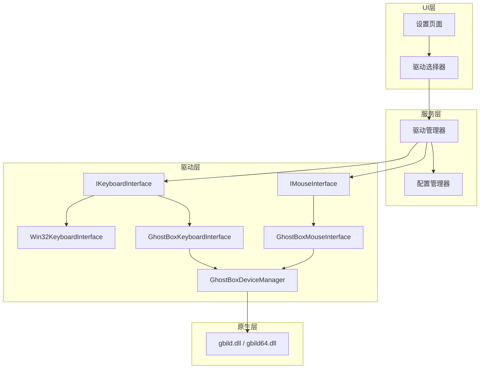

# 设计文档

## 概述

本设计实现输入驱动选择功能，允许用户在 Win32 软件模拟和 GhostBox 硬件驱动之间切换。设计采用工厂模式和依赖注入，确保驱动可以在运行时动态切换。

## 架构



## 组件和接口

### 1. 驱动类型枚举

```csharp
/// <summary>
/// 输入驱动类型
/// </summary>
public enum InputDriverType
{
    /// <summary>
    /// Win32 软件模拟 (默认)
    /// </summary>
    Win32 = 0,
    
    /// <summary>
    /// GhostBox 硬件驱动
    /// </summary>
    GhostBox = 1
}
```

### 2. GhostBox 设备管理器

```csharp
/// <summary>
/// GhostBox 设备管理器 - 单例模式
/// 管理设备连接，供键盘和鼠标驱动共享
/// </summary>
public class GhostBoxDeviceManager : IDisposable
{
    // P/Invoke 声明
    [DllImport("gbild", CallingConvention = CallingConvention.StdCall)]
    private static extern int opendevice(int index = 0);
    
    [DllImport("gbild", CallingConvention = CallingConvention.StdCall)]
    private static extern int isconnected();
    
    [DllImport("gbild", CallingConvention = CallingConvention.StdCall)]
    private static extern int closedevice();
    
    // 键盘操作
    [DllImport("gbild", CharSet = CharSet.Ansi, CallingConvention = CallingConvention.StdCall)]
    public static extern int presskeybyvalue(int keyv);
    
    [DllImport("gbild", CallingConvention = CallingConvention.StdCall)]
    public static extern int releasekeybyvalue(int keyv);
    
    [DllImport("gbild", CallingConvention = CallingConvention.StdCall)]
    public static extern int pressandreleasekeybyvalue(int keyv);
    
    // 鼠标操作
    [DllImport("gbild", CallingConvention = CallingConvention.StdCall)]
    public static extern int movemouseto(int x, int y);
    
    [DllImport("gbild", CallingConvention = CallingConvention.StdCall)]
    public static extern int pressmousebutton(int mbtn);
    
    [DllImport("gbild", CallingConvention = CallingConvention.StdCall)]
    public static extern int releasemousebutton(int mbtn);
    
    [DllImport("gbild", CallingConvention = CallingConvention.StdCall)]
    public static extern int pressandreleasemousebutton(int mbtn);
    
    // 属性
    public bool IsConnected { get; }
    public bool IsDllAvailable { get; }
    public string LastError { get; }
    
    // 方法
    public bool Connect();
    public void Disconnect();
}
```

### 3. 鼠标接口定义

```csharp
/// <summary>
/// 鼠标输入接口
/// </summary>
public interface IMouseInterface
{
    /// <summary>
    /// 移动鼠标到指定坐标
    /// </summary>
    bool MoveTo(int x, int y);
    
    /// <summary>
    /// 按下鼠标按钮
    /// </summary>
    /// <param name="button">1=左键, 2=右键, 3=中键</param>
    bool PressButton(int button);
    
    /// <summary>
    /// 释放鼠标按钮
    /// </summary>
    bool ReleaseButton(int button);
    
    /// <summary>
    /// 点击鼠标按钮（按下并释放）
    /// </summary>
    bool Click(int button);
}
```

### 4. GhostBox 键盘驱动

```csharp
/// <summary>
/// GhostBox 硬件键盘驱动
/// </summary>
public class GhostBoxKeyboardInterface : IKeyboardInterface
{
    private readonly GhostBoxDeviceManager _deviceManager;
    
    public GhostBoxKeyboardInterface(GhostBoxDeviceManager deviceManager)
    {
        _deviceManager = deviceManager;
    }
    
    public bool PressKey(int keyCode)
    {
        if (!_deviceManager.IsConnected) return false;
        return GhostBoxDeviceManager.presskeybyvalue(keyCode) != 0;
    }
    
    public bool ReleaseKey(int keyCode)
    {
        if (!_deviceManager.IsConnected) return false;
        return GhostBoxDeviceManager.releasekeybyvalue(keyCode) != 0;
    }
    
    public bool PressAndRelease(int keyCode)
    {
        if (!_deviceManager.IsConnected) return false;
        return GhostBoxDeviceManager.pressandreleasekeybyvalue(keyCode) != 0;
    }
}
```

### 5. GhostBox 鼠标驱动

```csharp
/// <summary>
/// GhostBox 硬件鼠标驱动
/// </summary>
public class GhostBoxMouseInterface : IMouseInterface
{
    private readonly GhostBoxDeviceManager _deviceManager;
    
    public GhostBoxMouseInterface(GhostBoxDeviceManager deviceManager)
    {
        _deviceManager = deviceManager;
    }
    
    public bool MoveTo(int x, int y)
    {
        if (!_deviceManager.IsConnected) return false;
        return GhostBoxDeviceManager.movemouseto(x, y) != 0;
    }
    
    public bool PressButton(int button)
    {
        if (!_deviceManager.IsConnected) return false;
        return GhostBoxDeviceManager.pressmousebutton(button) != 0;
    }
    
    public bool ReleaseButton(int button)
    {
        if (!_deviceManager.IsConnected) return false;
        return GhostBoxDeviceManager.releasemousebutton(button) != 0;
    }
    
    public bool Click(int button)
    {
        if (!_deviceManager.IsConnected) return false;
        return GhostBoxDeviceManager.pressandreleasemousebutton(button) != 0;
    }
}
```

### 6. 驱动管理器

```csharp
/// <summary>
/// 输入驱动管理器
/// 负责驱动的创建、切换和生命周期管理
/// </summary>
public class InputDriverManager : IDisposable
{
    private InputDriverType _currentDriverType;
    private IKeyboardInterface _keyboardInterface;
    private IMouseInterface? _mouseInterface;
    private readonly GhostBoxDeviceManager _ghostBoxDevice;
    
    // 事件
    public event EventHandler<DriverChangedEventArgs>? DriverChanged;
    public event EventHandler<string>? ConnectionStatusChanged;
    
    // 属性
    public InputDriverType CurrentDriverType => _currentDriverType;
    public IKeyboardInterface KeyboardInterface => _keyboardInterface;
    public IMouseInterface? MouseInterface => _mouseInterface;
    public bool IsGhostBoxAvailable => _ghostBoxDevice.IsDllAvailable;
    public bool IsGhostBoxConnected => _ghostBoxDevice.IsConnected;
    public string GhostBoxStatus => _ghostBoxDevice.IsConnected ? "已连接" : "未连接";
    
    // 方法
    public bool SwitchDriver(InputDriverType driverType);
    public bool ReconnectGhostBox();
}
```

## 数据模型

### 配置扩展

在 `appsettings.json` 中添加：

```json
{
  "InputDriverType": "Win32"
}
```

## 正确性属性

*正确性属性是系统在所有有效执行中应保持为真的特征或行为。属性作为人类可读规范和机器可验证正确性保证之间的桥梁。*

### 属性 1: 配置往返一致性

*对于任意* 驱动类型选择，保存到配置文件后再加载，应得到相同的驱动类型。

**验证: 需求 2.2, 2.3, 7.1**

### 属性 2: 驱动切换有效性

*对于任意* 驱动切换操作，切换后的 KeyboardInterface 应为对应类型的实例（Win32 或 GhostBox）。

**验证: 需求 6.1, 6.2**

### 属性 3: 设备连接共享

*对于任意* GhostBox 键盘和鼠标驱动实例，它们应共享同一个 GhostBoxDeviceManager 实例的连接状态。

**验证: 需求 4.4**

### 属性 4: 连接状态文本正确性

*对于任意* 设备连接状态，当 IsConnected 为 true 时状态文本应为 "已连接"，为 false 时应为 "未连接"。

**验证: 需求 5.2**

### 属性 5: 切换失败回退

*对于任意* 切换到 GhostBox 驱动失败的情况，系统应保持使用之前的驱动，CurrentDriverType 不应改变。

**验证: 需求 3.3, 6.3**

### 属性 6: 默认驱动

*对于任意* 缺少驱动配置或配置无效的情况，系统应使用 Win32 驱动作为默认值。

**验证: 需求 2.4, 7.2**

## 错误处理

| 错误场景 | 处理方式 |
|---------|---------|
| GhostBox DLL 不存在 | 禁用 GhostBox 选项，显示提示 |
| 设备连接失败 | 显示错误消息，回退到 Win32 |
| 运行时切换失败 | 保持当前驱动，通知用户 |
| 配置加载失败 | 使用默认 Win32 驱动 |

## 测试策略

### 单元测试

- 测试配置保存和加载
- 测试驱动切换逻辑
- 测试默认值处理
- 测试错误回退逻辑

### 属性测试

使用 FsCheck 进行属性测试：
- 配置往返测试
- 驱动切换有效性测试
- 连接状态文本测试

### 集成测试

- 测试 UI 与驱动管理器的交互
- 测试配置持久化完整流程
