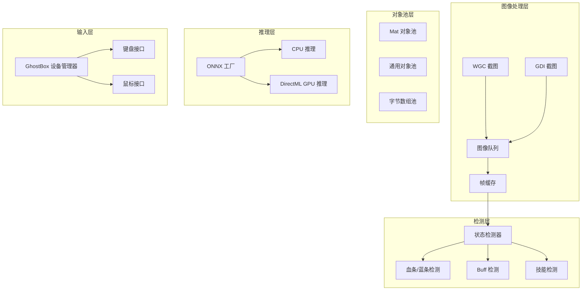

# 设计文档

## 概述

本设计文档描述了 ShineProCS 项目的性能优化实现方案，涵盖六个核心优化领域：图像检测算法、Buff 检测、血条/蓝条检测、对象池、GPU/CPU 切换和 GhostBox 输入优化。

## 架构

### 整体架构图



## 组件和接口

### 1. 图像检测优化组件

#### 1.1 帧差分检测器

```csharp
/// <summary>
/// 帧差分检测器 - 用于快速判断帧是否发生变化
/// </summary>
public class FrameDifferenceDetector
{
    private int _lastSampleSum;
    private readonly int _sampleStride;  // 采样步长，可配置
    
    /// <summary>
    /// 检测帧是否未发生变化
    /// </summary>
    /// <param name="frame">当前帧</param>
    /// <param name="threshold">变化阈值</param>
    /// <returns>true 表示帧未变化</returns>
    public bool IsFrameUnchanged(Mat frame, int threshold);
}
```

#### 1.2 边界框计算器

```csharp
/// <summary>
/// 边界框计算器 - 合并多个检测区域为单个边界框
/// </summary>
public class BoundingBoxCalculator
{
    /// <summary>
    /// 计算包含所有区域的最小边界框
    /// </summary>
    /// <param name="regions">区域列表 [x, y, w, h]</param>
    /// <returns>边界框 (x, y, w, h) 或 null</returns>
    public (int x, int y, int w, int h)? Calculate(IList<int[]> regions);
}
```

### 2. Buff 检测优化组件

#### 2.1 LRU 模板缓存

```csharp
/// <summary>
/// LRU 模板缓存 - 使用最近最少使用策略管理模板
/// </summary>
public class LruTemplateCache : IDisposable
{
    private readonly int _maxSize;
    private readonly Dictionary<string, LinkedListNode<CacheEntry>> _cache;
    private readonly LinkedList<CacheEntry> _lruList;
    
    public Mat? Get(string path);
    public void Set(string path, Mat template);
    public void Clear();
    public string GetStatistics();
}
```

#### 2.2 多尺度模板匹配器

```csharp
/// <summary>
/// 多尺度模板匹配器 - 支持不同 UI 缩放比例
/// </summary>
public class MultiScaleTemplateMatcher
{
    private readonly double[] _scales = { 0.8, 0.9, 1.0, 1.1, 1.2 };
    
    /// <summary>
    /// 执行多尺度模板匹配
    /// </summary>
    /// <param name="source">源图像</param>
    /// <param name="template">模板图像</param>
    /// <param name="threshold">匹配阈值</param>
    /// <returns>最佳匹配结果</returns>
    public (double similarity, double scale) Match(Mat source, Mat template, double threshold);
}
```

### 3. 血条/蓝条检测优化组件

#### 3.1 采样点检测器

```csharp
/// <summary>
/// 采样点检测器 - 使用采样点代替全区域扫描
/// </summary>
public class SamplingBarDetector
{
    private readonly int _minSampleCount = 5;
    private readonly int _maxSampleCount = 20;
    
    /// <summary>
    /// 检测血条/蓝条百分比
    /// </summary>
    /// <param name="barImage">条形区域图像</param>
    /// <param name="isHealth">是否为血条</param>
    /// <returns>百分比 (0-100)</returns>
    public double DetectPercentage(Mat barImage, bool isHealth);
}
```

#### 3.2 检测失败缓存

```csharp
/// <summary>
/// 检测失败缓存 - 连续失败时返回缓存值
/// </summary>
public class DetectionFailureCache
{
    private double _lastValidValue;
    private int _consecutiveFailures;
    private readonly int _maxFailures;
    
    public double GetValueOrCache(double? detectedValue);
    public void Reset();
}
```

### 4. 对象池组件

#### 4.1 Mat 对象池（已存在，需优化）

```csharp
/// <summary>
/// Mat 对象池 - 复用 OpenCV Mat 对象
/// </summary>
public class MatPool : IDisposable
{
    // 新增：尺寸匹配的智能复用
    public Mat Rent(int rows, int cols, MatType type);
    
    // 新增：验证对象状态
    public void Return(Mat? mat);
    
    // 新增：详细统计
    public PoolStatistics GetDetailedStats();
}

public record PoolStatistics(int Created, int Reused, int Disposed, int PoolSize, double ReuseRate);
```

### 5. GPU/CPU 切换组件

#### 5.1 简化的硬件加速配置

```csharp
/// <summary>
/// 硬件加速配置 - 简化版，仅支持 CPU 和 DirectML
/// </summary>
public partial class HardwareAccelerationConfig : ObservableObject
{
    /// <summary>
    /// 推理设备类型: CPU 或 DirectML
    /// </summary>
    [ObservableProperty]
    private InferenceDeviceType _inferenceDevice = InferenceDeviceType.Cpu;
    
    /// <summary>
    /// DirectML 设备 ID（默认 0）
    /// </summary>
    [ObservableProperty]
    private int _gpuDevice = 0;
    
    /// <summary>
    /// 强制 OCR 使用 CPU
    /// </summary>
    [ObservableProperty]
    private bool _cpuOcr = false;
}

public enum InferenceDeviceType
{
    Cpu = 0,
    DirectML = 1
}
```

### 6. GhostBox 输入优化组件

#### 6.1 随机延迟生成器

```csharp
/// <summary>
/// 随机延迟生成器 - 生成人类化的随机延迟
/// </summary>
public class RandomDelayGenerator
{
    private readonly Random _random = new();
    
    /// <summary>
    /// 生成指定范围内的随机延迟
    /// </summary>
    /// <param name="minMs">最小延迟（毫秒）</param>
    /// <param name="maxMs">最大延迟（毫秒）</param>
    /// <returns>随机延迟值</returns>
    public int Generate(int minMs, int maxMs);
}
```

#### 6.2 贝塞尔曲线鼠标移动

```csharp
/// <summary>
/// 贝塞尔曲线鼠标移动 - 模拟人类鼠标轨迹
/// </summary>
public class BezierMouseMover
{
    /// <summary>
    /// 生成从起点到终点的贝塞尔曲线路径点
    /// </summary>
    /// <param name="startX">起始 X</param>
    /// <param name="startY">起始 Y</param>
    /// <param name="endX">目标 X</param>
    /// <param name="endY">目标 Y</param>
    /// <param name="steps">路径点数量</param>
    /// <returns>路径点列表</returns>
    public List<(int x, int y)> GeneratePath(int startX, int startY, int endX, int endY, int steps = 20);
}
```

#### 6.3 自动重连管理器

```csharp
/// <summary>
/// 自动重连管理器 - 处理设备断开和重连
/// </summary>
public class AutoReconnectManager
{
    private readonly int _retryIntervalMs;
    private readonly int _maxRetries;
    private bool _isReconnecting;
    
    public event Action? OnReconnected;
    public event Action<string>? OnReconnectFailed;
    
    public Task StartReconnectAsync(CancellationToken token);
    public void Stop();
}
```

## 数据模型

### 输入延迟配置

```csharp
/// <summary>
/// 输入延迟配置
/// </summary>
public class InputDelayConfig
{
    /// <summary>
    /// 是否启用随机延迟
    /// </summary>
    public bool EnableRandomDelay { get; set; } = true;
    
    /// <summary>
    /// 按键最小延迟（毫秒）
    /// </summary>
    public int KeyPressMinDelayMs { get; set; } = 30;
    
    /// <summary>
    /// 按键最大延迟（毫秒）
    /// </summary>
    public int KeyPressMaxDelayMs { get; set; } = 80;
    
    /// <summary>
    /// 最小按键间隔（毫秒）
    /// </summary>
    public int MinInterKeyDelayMs { get; set; } = 20;
    
    /// <summary>
    /// 鼠标移动是否使用贝塞尔曲线
    /// </summary>
    public bool UseBezierMouseMove { get; set; } = true;
}
```

### 重连配置

```csharp
/// <summary>
/// 重连配置
/// </summary>
public class ReconnectConfig
{
    /// <summary>
    /// 是否启用自动重连
    /// </summary>
    public bool EnableAutoReconnect { get; set; } = true;
    
    /// <summary>
    /// 重连间隔（毫秒）
    /// </summary>
    public int RetryIntervalMs { get; set; } = 2000;
    
    /// <summary>
    /// 最大重试次数（0 = 无限）
    /// </summary>
    public int MaxRetries { get; set; } = 5;
}
```

## 正确性属性

*正确性属性是一种特性或行为，应该在系统的所有有效执行中保持为真——本质上是关于系统应该做什么的形式化陈述。属性作为人类可读规范和机器可验证正确性保证之间的桥梁。*

### 属性 1: 边界框包含所有区域

*对于任意* 区域列表，计算出的边界框应该包含所有输入区域的每个像素点。

**验证: 需求 1.2**

### 属性 2: CD 跳过逻辑正确性

*对于任意* 技能状态，当剩余 CD > 0.5 秒时，该技能应被标记为跳过视觉检测。

**验证: 需求 1.3**

### 属性 3: LRU 缓存淘汰正确性

*对于任意* 缓存操作序列，当缓存满时，最近最少使用的项应该被淘汰。

**验证: 需求 2.2**

### 属性 4: 采样点位于中线

*对于任意* 血条/蓝条图像，所有采样点的 Y 坐标应该等于图像高度的一半。

**验证: 需求 3.1**

### 属性 5: 连续失败返回缓存值

*对于任意* 连续失败次数达到最大值后，检测器应返回上次有效的缓存值。

**验证: 需求 3.2, 3.5**

### 属性 6: 对象池复用正确性

*对于任意* Rent/Return 操作序列，Return 后的对象应该可以被后续 Rent 复用。

**验证: 需求 4.1**

### 属性 7: 池容量限制

*对于任意* 对象池，池中对象数量不应超过配置的最大容量。

**验证: 需求 4.2**

### 属性 8: 随机延迟在范围内

*对于任意* 延迟生成请求，生成的延迟值应该在 [minMs, maxMs] 范围内。

**验证: 需求 6.1, 6.2**

### 属性 9: 贝塞尔曲线端点正确

*对于任意* 贝塞尔曲线路径，第一个点应该是起点，最后一个点应该是终点。

**验证: 需求 6.3**

### 属性 10: 最小按键间隔保证

*对于任意* 连续按键操作，两次按键之间的间隔不应小于配置的最小间隔。

**验证: 需求 6.6**

## 错误处理

### 图像检测错误

- 截图失败时返回 null，调用方使用缓存帧
- 模板匹配失败时返回 0 相似度
- 边界框计算失败时返回 null，跳过优化直接单独截图

### Buff 检测错误

- 模板加载失败时记录日志，返回 false（Buff 不存在）
- 缓存帧裁剪失败时回退到单独截图

### 血条检测错误

- 连续失败超过阈值时使用缓存值
- 颜色检测失败时返回 0%

### GhostBox 错误

- 设备断开时触发重连流程
- 重连失败时通知引擎暂停
- 按键操作失败时记录日志并返回 false

## 测试策略

### 单元测试

- 边界框计算器的边界情况测试
- LRU 缓存的淘汰逻辑测试
- 采样点检测器的颜色识别测试
- 对象池的 Rent/Return 测试
- 随机延迟生成器的范围测试
- 贝塞尔曲线生成器的端点测试

### 属性测试

使用 FsCheck 或类似库进行属性测试：

- 边界框包含性属性
- LRU 淘汰顺序属性
- 对象池复用属性
- 延迟范围属性
- 贝塞尔曲线属性

### 集成测试

- 完整检测流程测试（截图 → 检测 → 结果）
- GPU/CPU 切换测试
- GhostBox 断线重连测试

