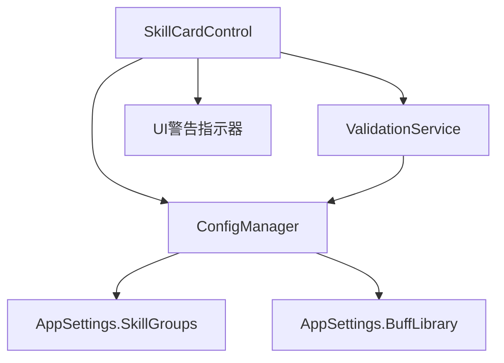

# 设计文档

## 概述

本设计文档描述如何实现技能配置中引用验证功能，确保技能组和Buff引用只能选择已配置的有效选项，并对无效引用提供视觉警告。

## 架构

### 组件交互图



### 设计决策

1. **不可编辑下拉框**: 将所有引用类下拉框改为 `IsEditable="False"`，防止用户输入无效值
2. **空选项**: 在每个下拉框中添加空字符串选项，允许用户清空选择
3. **无效引用显示**: 当存在无效引用时，在下拉框旁显示警告图标和工具提示
4. **向后兼容**: 保留现有无效引用值，但以警告样式显示

## 组件和接口

### 1. SkillCardControl 修改

#### XAML 修改
- 移除所有引用下拉框的 `IsEditable="True"` 属性
- 为每个引用下拉框添加警告图标元素

#### 代码后台修改
- 添加 `ValidateReferences()` 方法检查当前技能的所有引用
- 修改各 `Refresh*ComboBox()` 方法，处理无效引用的显示

### 2. 验证逻辑

```csharp
// 验证技能组引用
public bool IsValidSkillGroup(string groupName)
{
    if (string.IsNullOrEmpty(groupName)) return true;
    return _configManager.AppSettings.SkillGroups
        .Any(g => g.Enabled && g.Name == groupName);
}

// 验证Buff引用
public bool IsValidBuff(string buffName)
{
    if (string.IsNullOrEmpty(buffName)) return true;
    return _configManager.AppSettings.BuffLibrary
        .Any(b => b.Enabled && b.Name == buffName);
}
```

## 数据模型

无需修改现有数据模型。验证逻辑基于现有的：
- `AppSettings.SkillGroups` - 技能组集合
- `AppSettings.BuffLibrary` - Buff库集合
- `SkillConfig` - 技能配置（包含各种引用字段）

## 正确性属性

*正确性属性是应该在系统所有有效执行中保持为真的特征或行为——本质上是关于系统应该做什么的正式声明。属性作为人类可读规范和机器可验证正确性保证之间的桥梁。*

### 属性1: 下拉框选项与配置集合一致性
*对于任何*技能组配置集合和Buff库配置集合，刷新下拉框后，下拉框中的所有非空选项都应该在对应的已启用配置项中存在，且所有已启用配置项都应该出现在下拉框选项中。
**验证: 需求 1.1, 2.1**

### 属性2: 无效引用检测正确性
*对于任何*技能配置和引用值，如果引用值非空且在对应配置集合中不存在或未启用，`IsValidSkillGroup()` 或 `IsValidBuff()` 方法应返回 false；如果引用值为空或在配置集合中存在且启用，应返回 true。
**验证: 需求 1.2, 2.2, 4.1**

### 属性3: 删除配置后的引用识别
*对于任何*技能配置集合，当从技能组或Buff库中删除某个配置项后，验证系统应能正确识别所有引用该配置项的技能。
**验证: 需求 1.3, 2.3, 4.3**

### 属性4: 空选项可用性
*对于任何*引用下拉框的选项列表，都应包含一个空字符串作为第一个选项，允许用户清空当前选择。
**验证: 需求 3.2**

## 错误处理

1. **ConfigManager 为空**: 在 `OnLoaded` 中检查，如果为空则跳过刷新操作
2. **无效引用**: 不阻止保存，但显示警告提示用户
3. **集合为空**: 下拉框仅显示空选项

## 测试策略

### 单元测试
- 测试 `IsValidSkillGroup()` 方法对有效/无效/空值的处理
- 测试 `IsValidBuff()` 方法对有效/无效/空值的处理
- 测试下拉框刷新逻辑是否正确过滤禁用项

### 集成测试
- 测试从全局设置删除技能组后，技能配置页面的警告显示
- 测试从Buff库删除Buff后，技能配置页面的警告显示

### 属性测试
- **属性1测试**: 生成随机的技能组/Buff配置，验证下拉框选项与配置集合的一致性
- **属性2测试**: 生成随机的技能配置和引用值，验证无效引用检测的正确性
