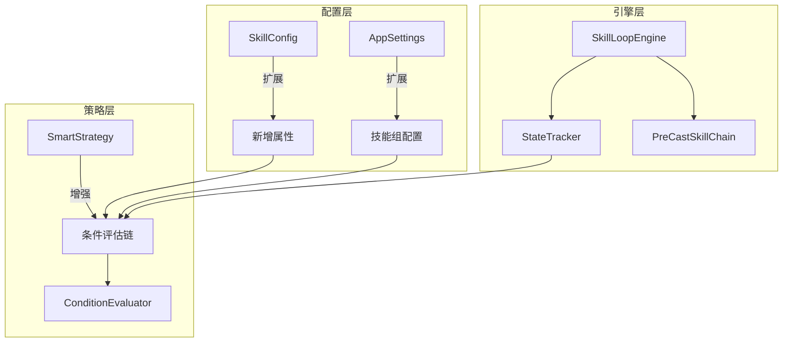

# 设计文档

## 概述

本设计通过扩展现有的配置系统和策略逻辑，使C#版本能够通过配置驱动的方式模拟Python版本的技能释放行为。核心思路是：
1. 扩展SkillConfig模型，添加条件Buff、优先级覆盖、状态追踪等配置项
2. 扩展AppSettings模型，添加技能组和状态追踪器配置
3. 增强SmartStrategy，支持所有新配置选项的评估
4. 在SkillLoopEngine中实现状态追踪器和前置技能链逻辑

## 架构



## 组件和接口

### 1. SkillConfig模型扩展

在现有SkillConfig基础上添加以下属性：

```csharp
// 条件Buff - 技能释放前置条件
public string ConditionBuff { get; set; } = "";

// 优先级覆盖条件（Buff名称）
public string PriorityOverrideCondition { get; set; } = "";

// 优先级覆盖值
public int PriorityOverrideValue { get; set; }

// MP优先级加成
public int MpPriorityBoost { get; set; }

// MP加成阈值（百分比）
public double MpThresholdForBoost { get; set; }

// 前置技能名称（通过名称引用）
public string PreCastSkillName { get; set; } = "";

// 技能组名称
public string SkillGroup { get; set; } = "";

// 施法后设置状态
public string SetStateOnCast { get; set; } = "";

// 施法后清除状态
public string ClearStateOnCast { get; set; } = "";

// 要求状态为true才能释放
public string RequireState { get; set; } = "";
```

### 2. AppSettings模型扩展

```csharp
// 技能组配置
public class SkillGroupConfig
{
    public string Name { get; set; } = "";
    public string ConditionBuff { get; set; } = "";
    public bool Enabled { get; set; } = true;
}

// 在AppSettings中添加
public ObservableCollection<SkillGroupConfig> SkillGroups { get; set; } = [];
```

### 3. StateTracker服务

```csharp
public class StateTracker
{
    private readonly Dictionary<string, bool> _states = new();
    
    public bool GetState(string name);
    public void SetState(string name, bool value);
    public void ClearState(string name);
    public void ClearAll();
}
```

### 4. ConditionEvaluator服务

```csharp
public class ConditionEvaluator
{
    public bool EvaluateSkillConditions(
        SkillRuntimeState skill,
        StrategyContext context,
        StateTracker stateTracker);
    
    public int CalculateEffectivePriority(
        SkillRuntimeState skill,
        StrategyContext context,
        StateTracker stateTracker);
}
```

## 数据模型

### 技能配置JSON结构

```json
{
  "Name": "赤芍寒香",
  "KeyCode": 54,
  "Priority": 60,
  "Enabled": true,
  "ConditionBuff": "千枝气劲",
  "PriorityOverrideCondition": "千枝气劲",
  "PriorityOverrideValue": 200,
  "MpPriorityBoost": 50,
  "MpThresholdForBoost": 30,
  "PreCastSkillName": "千枝绽蕊",
  "SkillGroup": "素柯技能组",
  "SetStateOnCast": "",
  "ClearStateOnCast": "",
  "RequireState": ""
}
```

### 技能组配置JSON结构

```json
{
  "SkillGroups": [
    {
      "Name": "素柯技能组",
      "ConditionBuff": "素柯状态",
      "Enabled": true
    }
  ]
}
```

## 正确性属性

*正确性属性是一种特征或行为，应该在系统的所有有效执行中保持为真——本质上是关于系统应该做什么的形式化陈述。属性作为人类可读规范和机器可验证正确性保证之间的桥梁。*

### Property 1: Buff条件检查一致性

*对于任意*配置了ConditionBuff的技能和任意Buff状态，当Buff存在时技能应被纳入候选，当Buff不存在时技能应被跳过。

**验证: 需求 1.1, 1.2, 1.3**

### Property 2: 优先级覆盖正确性

*对于任意*配置了PriorityOverrideCondition的技能，当条件满足时有效优先级应等于PriorityOverrideValue，当条件不满足时有效优先级应等于基础Priority。

**验证: 需求 2.1, 2.2, 2.3**

### Property 3: 技能组条件传递性

*对于任意*属于技能组的技能，当组条件不满足时该组所有技能都应被跳过，当组条件满足时应继续评估个人条件。

**验证: 需求 3.1, 3.2, 3.4**

### Property 4: MP优先级加成计算

*对于任意*配置了MpPriorityBoost的技能，当MP高于MpThresholdForBoost时有效优先级应增加MpPriorityBoost，否则不增加。

**验证: 需求 4.1, 4.2**

### Property 5: 前置技能链执行顺序

*对于任意*配置了PreCastSkillName的技能，前置技能应在主技能之前释放，且两者之间应有ComboDelay的延迟。

**验证: 需求 5.1, 5.2, 5.3**

### Property 6: 状态追踪持久性

*对于任意*状态名称，SetStateOnCast应将状态设为true，ClearStateOnCast应将状态设为false，状态应在周期间持久化直到被显式修改。

**验证: 需求 6.1, 6.2, 6.3, 6.4, 6.5**

### Property 7: 智能策略选择正确性

*对于任意*技能列表和游戏状态，SmartStrategy应选择满足所有条件且有效优先级最高的技能，平局时按配置顺序选择。

**验证: 需求 8.1, 8.2, 8.3, 8.4**

## 错误处理

1. **无效Buff引用**: 当ConditionBuff引用的Buff在BuffLibrary中不存在时，视为条件满足（不阻止技能释放）
2. **无效技能引用**: 当PreCastSkillName引用的技能不存在时，跳过前置技能直接释放主技能
3. **无效技能组引用**: 当SkillGroup引用的组不存在时，忽略组条件
4. **循环引用检测**: 前置技能链应检测循环引用，发现时记录警告并跳过

## 测试策略

### 单元测试

- ConditionEvaluator的条件评估逻辑
- StateTracker的状态管理逻辑
- SkillConfig新属性的序列化/反序列化

### 属性测试

使用FsCheck进行属性测试：
- 生成随机技能配置和游戏状态
- 验证条件评估的一致性
- 验证优先级计算的正确性
- 验证状态追踪的持久性

### 集成测试

- 完整的技能选择流程测试
- 前置技能链的执行测试
- 配置热重载后的行为一致性测试
