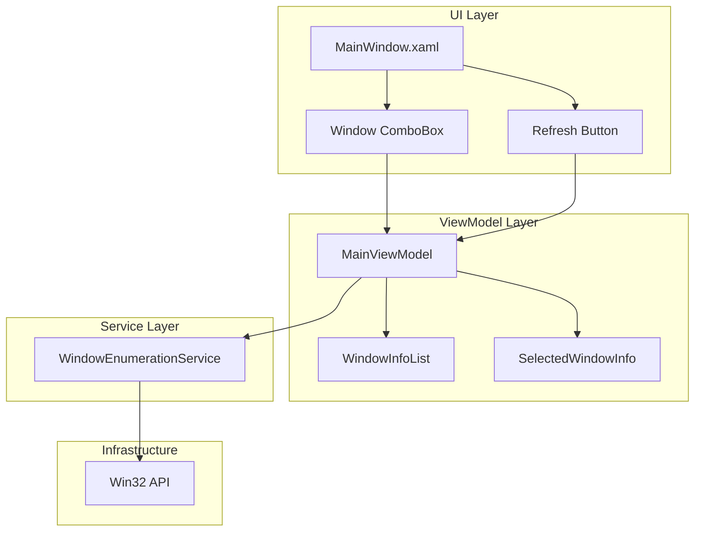

# Design Document: Window Process Selector

## Overview

本设计文档描述了窗口进程选择器功能的技术实现方案。该功能将替换原有的手动输入窗口标题方式，改为通过下拉框选择目标窗口，并提供刷新按钮来更新窗口列表。

## Architecture



## Components and Interfaces

### 1. WindowInfo Model

```csharp
/// <summary>
/// 窗口信息模型
/// </summary>
public class WindowInfo
{
    /// <summary>
    /// 窗口句柄
    /// </summary>
    public IntPtr Handle { get; set; }
    
    /// <summary>
    /// 窗口标题
    /// </summary>
    public string Title { get; set; } = string.Empty;
    
    /// <summary>
    /// 进程名称
    /// </summary>
    public string ProcessName { get; set; } = string.Empty;
    
    /// <summary>
    /// 进程ID
    /// </summary>
    public int ProcessId { get; set; }
    
    /// <summary>
    /// 显示文本，格式为 "[进程名] 窗口标题"
    /// </summary>
    public string DisplayText => $"[{ProcessName}] {Title}";
}
```

### 2. IWindowEnumerationService Interface

```csharp
/// <summary>
/// 窗口枚举服务接口
/// </summary>
public interface IWindowEnumerationService
{
    /// <summary>
    /// 获取所有可见窗口列表
    /// </summary>
    /// <returns>窗口信息列表</returns>
    List<WindowInfo> GetVisibleWindows();
    
    /// <summary>
    /// 检查窗口是否仍然存在
    /// </summary>
    /// <param name="handle">窗口句柄</param>
    /// <returns>窗口是否存在</returns>
    bool IsWindowValid(IntPtr handle);
    
    /// <summary>
    /// 根据标题查找窗口
    /// </summary>
    /// <param name="title">窗口标题</param>
    /// <returns>匹配的窗口信息，未找到返回null</returns>
    WindowInfo? FindWindowByTitle(string title);
}
```

### 3. WindowEnumerationService Implementation

```csharp
/// <summary>
/// 窗口枚举服务实现
/// </summary>
public class WindowEnumerationService : IWindowEnumerationService
{
    // P/Invoke declarations
    [DllImport("user32.dll")]
    private static extern bool EnumWindows(EnumWindowsProc lpEnumFunc, IntPtr lParam);
    
    [DllImport("user32.dll")]
    private static extern bool IsWindowVisible(IntPtr hWnd);
    
    [DllImport("user32.dll", CharSet = CharSet.Unicode)]
    private static extern int GetWindowText(IntPtr hWnd, StringBuilder lpString, int nMaxCount);
    
    [DllImport("user32.dll")]
    private static extern int GetWindowTextLength(IntPtr hWnd);
    
    [DllImport("user32.dll")]
    private static extern uint GetWindowThreadProcessId(IntPtr hWnd, out uint lpdwProcessId);
    
    [DllImport("user32.dll")]
    private static extern bool IsWindow(IntPtr hWnd);
    
    private delegate bool EnumWindowsProc(IntPtr hWnd, IntPtr lParam);
    
    public List<WindowInfo> GetVisibleWindows()
    {
        var windows = new List<WindowInfo>();
        
        EnumWindows((hWnd, lParam) =>
        {
            if (!IsWindowVisible(hWnd))
                return true;
            
            int length = GetWindowTextLength(hWnd);
            if (length == 0)
                return true;
            
            var sb = new StringBuilder(length + 1);
            GetWindowText(hWnd, sb, sb.Capacity);
            string title = sb.ToString();
            
            if (string.IsNullOrWhiteSpace(title))
                return true;
            
            GetWindowThreadProcessId(hWnd, out uint processId);
            string processName = GetProcessName((int)processId);
            
            windows.Add(new WindowInfo
            {
                Handle = hWnd,
                Title = title,
                ProcessName = processName,
                ProcessId = (int)processId
            });
            
            return true;
        }, IntPtr.Zero);
        
        return windows.OrderBy(w => w.ProcessName).ThenBy(w => w.Title).ToList();
    }
    
    public bool IsWindowValid(IntPtr handle)
    {
        return IsWindow(handle) && IsWindowVisible(handle);
    }
    
    public WindowInfo? FindWindowByTitle(string title)
    {
        if (string.IsNullOrEmpty(title))
            return null;
        
        var windows = GetVisibleWindows();
        return windows.FirstOrDefault(w => w.Title.Equals(title, StringComparison.OrdinalIgnoreCase))
            ?? windows.FirstOrDefault(w => w.Title.Contains(title, StringComparison.OrdinalIgnoreCase));
    }
    
    private string GetProcessName(int processId)
    {
        try
        {
            using var process = Process.GetProcessById(processId);
            return process.ProcessName;
        }
        catch
        {
            return "Unknown";
        }
    }
}
```

### 4. MainViewModel Extensions

```csharp
// 新增属性
[ObservableProperty]
private ObservableCollection<WindowInfo> _windowList = new();

[ObservableProperty]
private WindowInfo? _selectedWindow;

[ObservableProperty]
private bool _isRefreshingWindows;

// 新增命令
[RelayCommand]
private async Task RefreshWindowListAsync()
{
    IsRefreshingWindows = true;
    try
    {
        var currentSelection = SelectedWindow?.Title;
        var windows = await Task.Run(() => _windowService.GetVisibleWindows());
        
        WindowList.Clear();
        foreach (var window in windows)
        {
            WindowList.Add(window);
        }
        
        // 尝试恢复之前的选择
        if (!string.IsNullOrEmpty(currentSelection))
        {
            SelectedWindow = WindowList.FirstOrDefault(w => w.Title == currentSelection);
        }
    }
    finally
    {
        IsRefreshingWindows = false;
    }
}

partial void OnSelectedWindowChanged(WindowInfo? value)
{
    if (value != null)
    {
        AppSettings.GameWindowTitle = value.Title;
    }
}
```

## Data Models

### WindowInfo

| Property | Type | Description |
|----------|------|-------------|
| Handle | IntPtr | 窗口句柄，用于后续操作 |
| Title | string | 窗口标题 |
| ProcessName | string | 进程名称 |
| ProcessId | int | 进程ID |
| DisplayText | string | 显示文本，格式为 "[进程名] 窗口标题" |

### Configuration Changes

AppSettings 中的 `GameWindowTitle` 属性保持不变，用于存储选中窗口的标题。

## Correctness Properties

*A property is a characteristic or behavior that should hold true across all valid executions of a system-essentially, a formal statement about what the system should do. Properties serve as the bridge between human-readable specifications and machine-verifiable correctness guarantees.*

### Property 1: Window List Contains Only Visible Windows with Titles

*For any* call to GetVisibleWindows(), all returned WindowInfo objects should have:
- Non-empty Title
- Non-empty ProcessName
- Valid Handle (non-zero)

**Validates: Requirements 1.1, 1.2, 1.3**

### Property 2: Window Display Format Consistency

*For any* WindowInfo object, the DisplayText property should equal the format "[{ProcessName}] {Title}".

**Validates: Requirements 2.1**

### Property 3: Selection Updates Configuration

*For any* window selection change where the new selection is not null, the AppSettings.GameWindowTitle should equal the selected window's Title.

**Validates: Requirements 2.2, 3.1**

### Property 4: Startup Window Matching

*For any* saved window title and list of available windows, if a window with matching title exists, it should be selected; otherwise, selection should be null.

**Validates: Requirements 3.2, 3.3, 3.4**

### Property 5: Selection Preservation on Refresh

*For any* refresh operation where the previously selected window still exists in the new list, the selection should be preserved.

**Validates: Requirements 4.4**

### Property 6: Window Validity Check

*For any* window handle, IsWindowValid should return true only if the window exists and is visible.

**Validates: Requirements 5.1**

## Error Handling

| Error Scenario | Handling Strategy |
|----------------|-------------------|
| Window enumeration fails | Log error, maintain previous list, show error message |
| Process name retrieval fails | Use "Unknown" as process name |
| Selected window no longer exists | Clear selection, show warning message |
| Invalid window handle | Return false from IsWindowValid |

## Testing Strategy

### Unit Tests

1. **WindowInfo DisplayText Format Test**
   - Verify DisplayText follows "[ProcessName] Title" format

2. **Window Filtering Test**
   - Verify windows with empty titles are excluded
   - Verify invisible windows are excluded

3. **Window Matching Test**
   - Verify exact title match works
   - Verify partial title match works as fallback

### Property-Based Tests

使用 FsCheck 进行属性测试：

1. **Property 1**: 生成随机窗口列表，验证过滤逻辑
2. **Property 2**: 生成随机 WindowInfo，验证 DisplayText 格式
3. **Property 3**: 模拟选择变化，验证配置更新
4. **Property 4**: 生成随机标题和窗口列表，验证匹配逻辑
5. **Property 5**: 模拟刷新操作，验证选择保持
6. **Property 6**: 生成随机句柄，验证有效性检查

### Integration Tests

1. 测试 UI 绑定是否正确
2. 测试刷新按钮交互
3. 测试配置持久化
